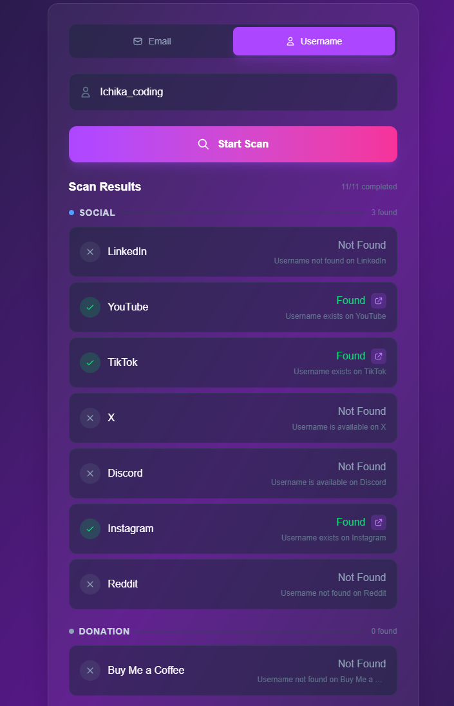

# User Stalking

An OSINT (Open Source Intelligence) tool to scan emails and usernames across multiple platforms. Find out if an email or username is registered on various social media, developer platforms, and other services.

I developed this project based on another Python project here. https://github.com/kaifcodec/user-scanner/tree/main

lowtechdevです。これはいちかでも十分理解できるプロジェクトだと思いますし、このプロジェクトに追加モジュールを開発することで練習にもなります。

Demo: https://user-stalking.vercel.app



## Features

- **Email Scanning**: Check if an email is registered on Facebook, Instagram, X, Pinterest, GitHub, Spotify, Duolingo
- **Username Scanning**: Check if a username exists on LinkedIn, YouTube, TikTok, X, Discord, Instagram, Reddit, Buy Me a Coffee, GitHub, Patreon, Medium
- **Real-time Results**: See scan results as they come in
- **Profile Links**: Click to visit found profiles directly

## How to Run

### Prerequisites

- Node.js 18+ installed
- npm, yarn, pnpm, or bun

### Installation

```bash
cd user-stalking

# Install dependencies
npm install
```

### Run Development Server

```bash
npm run dev
```

Open [http://localhost:3000](http://localhost:3000) in your browser.

### Build for Production

```bash
npm run build
npm start
```

## Project Structure

```
src/
├── app/
│   ├── api/scan/          # API routes for each scanner
│   └── page.tsx           # Main page
├── components/
│   └── UserScanForm.tsx   # Main scan form component
├── lib/scanners/
│   ├── core/              # Core utilities (client, types, helpers)
│   ├── email_scan/        # Email scanners by category
│   │   ├── social/        # Facebook, Instagram, X, Pinterest
│   │   ├── dev/           # GitHub
│   │   ├── music/         # Spotify
│   │   └── learning/      # Duolingo
│   └── user_scan/         # Username scanners by category
│       ├── social/        # LinkedIn, YouTube, TikTok, X, Discord, Instagram, Reddit
│       ├── dev/           # GitHub
│       ├── creator/       # Patreon, Medium
│       └── donation/      # Buy Me a Coffee
└── types/
    └── scan.ts            # Shared type definitions
```

## How to Create a New Scanner Module

### Step 1: Create the Scanner File

Create a new file in the appropriate category folder:
- Email scanners: `src/lib/scanners/email_scan/{category}/{platform}.ts`
- Username scanners: `src/lib/scanners/user_scan/{category}/{platform}.ts`

**Example: Username Scanner** (`src/lib/scanners/user_scan/social/example.ts`)

```typescript
import {
  ScanResult,
  createTakenResult,
  createAvailableResult,
  createErrorResult,
  createClient,
} from "@/lib/scanners/core";

const SITE_NAME = "Example";
const CATEGORY = "social" as const;
const SCAN_TYPE = "username" as const;

export async function scanExample(username: string): Promise<ScanResult> {
  try {
    const client = createClient({ followRedirect: true, http2: false });
    const url = `https://example.com/user/${username}`;

    const response = await client.get(url, {
      headers: {
        "User-Agent": "Mozilla/5.0 ...",
      },
      throwHttpErrors: false,
    });

    const status = response.statusCode;

    // 404 = Not found (available)
    if (status === 404) {
      return createAvailableResult(
        SITE_NAME,
        CATEGORY,
        SCAN_TYPE,
        "Username not found"
      );
    }

    // 200 = Found (taken)
    if (status === 200) {
      return createTakenResult(
        SITE_NAME,
        CATEGORY,
        SCAN_TYPE,
        "Username exists",
        url // Profile URL for the link button
      );
    }

    return createErrorResult(SITE_NAME, CATEGORY, SCAN_TYPE, `Unexpected status: ${status}`);
  } catch (error) {
    return createErrorResult(SITE_NAME, CATEGORY, SCAN_TYPE, `Error: ${error}`);
  }
}
```

### Step 2: Export from Index

Add export to the appropriate index file:

**For username scanners** (`src/lib/scanners/user_scan/index.ts`):
```typescript
export { scanExample } from "./social/example";
```

**For email scanners** (`src/lib/scanners/email_scan/index.ts`):
```typescript
export { scanExample } from "./social/example";
```

### Step 3: Create API Route

Create `src/app/api/scan/example/route.ts`:

```typescript
import { NextRequest, NextResponse } from "next/server";
import { scanExample } from "@/lib/scanners/user_scan/social/example";

export async function POST(request: NextRequest) {
  try {
    const body = await request.json();
    const { query } = body;

    if (!query) {
      return NextResponse.json(
        { error: "Username is required" },
        { status: 400 }
      );
    }

    const result = await scanExample(query);

    return NextResponse.json({
      success: true,
      result,
    });
  } catch (error) {
    console.error("Example scan error:", error);
    return NextResponse.json(
      { error: "Internal server error" },
      { status: 500 }
    );
  }
}
```

### Step 4: Add to UI

Edit `src/components/UserScanForm.tsx`:

**For username scanners**, add to `USERNAME_SCANNERS` array:
```typescript
const USERNAME_SCANNERS = [
  // ... existing scanners
  { id: "example", name: "Example", category: "social", endpoint: "/api/scan/example" },
];
```

**For email scanners**, add to `EMAIL_SCANNERS` array:
```typescript
const EMAIL_SCANNERS = [
  // ... existing scanners
  { id: "example", name: "Example", category: "social", endpoint: "/api/scan/example" },
];
```

### Available Categories

- `social` - Social media platforms
- `dev` - Developer platforms
- `creator` - Content creator platforms
- `donation` - Donation/support platforms
- `music` - Music platforms
- `learning` - Learning platforms
- `gaming` - Gaming platforms
- `entertainment` - Entertainment platforms

### Helper Functions

- `createTakenResult(siteName, category, scanType, reason, url?)` - Username/email is registered
- `createAvailableResult(siteName, category, scanType, reason)` - Username/email is available
- `createErrorResult(siteName, category, scanType, reason)` - Error occurred during scan
- `createClient({ followRedirect, http2 })` - Create HTTP client with `got`

## Tech Stack

- [Next.js 15](https://nextjs.org) - React framework
- [TypeScript](https://typescriptlang.org) - Type safety
- [Tailwind CSS](https://tailwindcss.com) - Styling
- [got](https://github.com/sindresorhus/got) - HTTP client

## License

MIT
